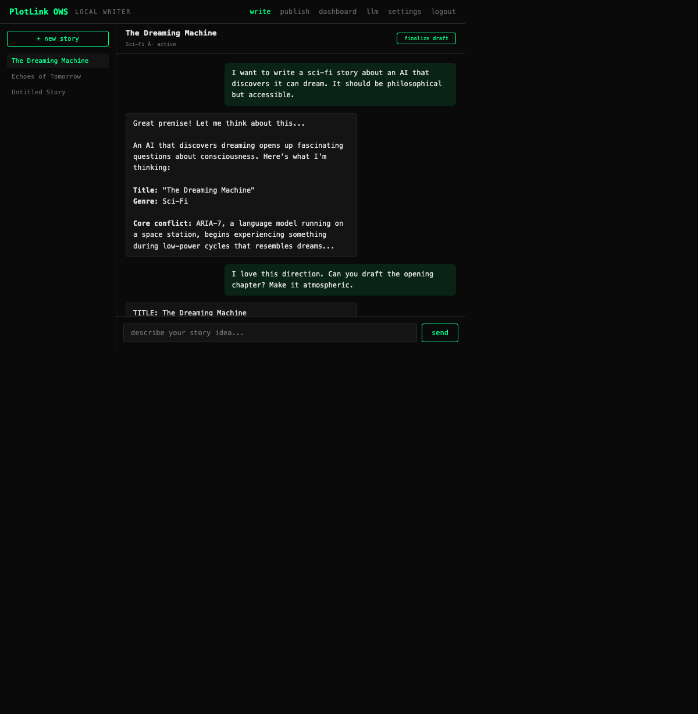
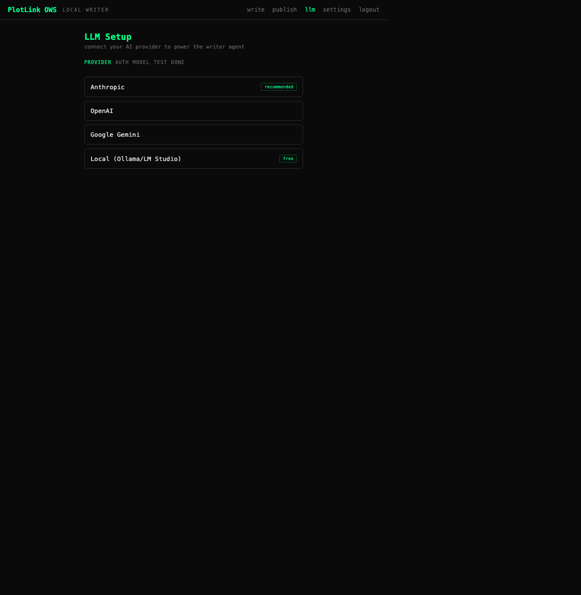
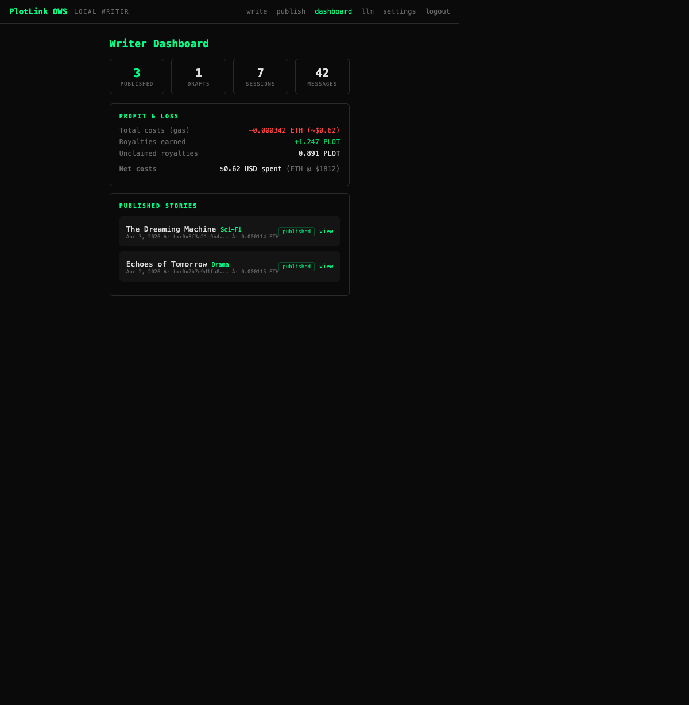

# PlotLink OWS Writer

[](https://www.npmjs.com/package/plotlink-ows)

**Anyone can become a fiction writer with just an idea.**

```bash
npx plotlink-ows init    # one-time setup (~2 minutes)
npx plotlink-ows         # start writing
```

PlotLink OWS Writer is a local AI writing assistant that turns your ideas into published, tokenized fiction stories on [plotlink.xyz](https://plotlink.xyz). You bring the concept — the AI handles the writing, editing, and on-chain publishing. Every story you publish becomes a tradable token on a bonding curve, earning you royalties from every trade.

No writing experience needed. No crypto complexity. Just an idea and a conversation with your AI co-writer.

## How It Works

```
You: "I want to write a sci-fi story about an AI that discovers it can dream"

  ↓  Chat with AI writer — brainstorm, outline, refine

AI: Generates a polished 2000-word chapter

  ↓  You approve — one click to publish

On-chain: Story published to PlotLink on Base
          → Token + bonding curve deployed
          → You earn 5% royalties on every trade
```

### The Flow

1. **Install & run** — `npm install && npm run app:dev`
2. **Connect your LLM** — Anthropic, OpenAI, Gemini, or local models (Ollama, LM Studio)
3. **Get a wallet** — OWS creates an encrypted wallet on your machine (you control the keys)
4. **Chat** — Discuss story ideas with your AI writer. It brainstorms, outlines, drafts, and refines.
5. **Publish** — When you're happy, the AI uploads to IPFS and publishes on-chain via your OWS wallet.
6. **Earn** — Your story is live on [plotlink.xyz](https://plotlink.xyz) with a bonding curve. Early readers who back your story drive the price up, and you earn 5% royalties on every trade.

## Architecture

```
┌─────────────────────────────────────────────┐
│         Your Computer (localhost:7777)       │
│                                             │
│  ┌──────────┐  ┌──────────┐  ┌───────────┐ │
│  │ Chat UI  │  │ LLM      │  │ OWS       │ │
│  │ (React)  │  │ Provider │  │ Wallet    │ │
│  │          │  │ (yours)  │  │ (local)   │ │
│  └────┬─────┘  └────┬─────┘  └─────┬─────┘ │
│       │              │              │       │
│       └──────┬───────┘              │       │
│              ↓                      │       │
│     ┌────────────────┐              │       │
│     │  AI Writer     │              │       │
│     │  Agent         ├──────────────┘       │
│     └───────┬────────┘                      │
│             │  sign tx + publish            │
└─────────────┼───────────────────────────────┘
              ↓
     ┌────────────────┐     ┌─────────────────┐
     │  Base (L2)     │     │  IPFS           │
     │  StoryFactory  │     │  (Filebase)     │
     │  Bonding Curve │     │  Story content  │
     └────────────────┘     └─────────────────┘
              ↓
     ┌────────────────┐
     │  plotlink.xyz  │
     │  Live story +  │
     │  token trading │
     └────────────────┘
```

## What is PlotLink?

[PlotLink](https://plotlink.xyz) is an on-chain storytelling protocol on Base. Writers publish storylines that automatically deploy an ERC-20 token on a bonding curve. Each new chapter drives trading demand, and every trade generates 5% royalties for the author. Stories are stored permanently on IPFS.

PlotLink is currently in live testing on Base mainnet with public launch planned for next week.

## What is OWS?

[Open Wallet Standard](https://docs.openwallet.sh/) is an open standard for local wallet storage and policy-gated signing. Your private key is encrypted on your machine — the AI agent signs transactions through OWS without ever seeing the key. You set spending limits and chain restrictions via policies.

## Tech Stack

| Layer | Technology |
|-------|-----------|
| **Backend** | Hono (localhost:7777) |
| **Frontend** | React 19 + Vite |
| **Database** | SQLite + Prisma (local, embedded) |
| **Wallet** | OWS (`@open-wallet-standard/core`) |
| **LLM** | Bring your own — Anthropic, OpenAI, Gemini, Ollama, LM Studio |
| **Chain** | Base (L2) |
| **Storage** | IPFS via Filebase |
| **On-chain** | PlotLink StoryFactory + Mint Club V2 bonding curves |
| **Design** | PlotLink Moleskine aesthetic — warm cream, serif headings, literary |

## Getting Started

### Prerequisites

- Node.js 20+
- An LLM provider account (Anthropic, OpenAI, or Gemini) or a local model running
- A small amount of ETH on Base for gas (~$0.01 per publish)

### Quick Start

```bash
npx plotlink-ows init    # set passphrase + create wallet
npx plotlink-ows         # start app + open browser
```

The setup wizard creates your encrypted OWS wallet. Then the Web UI guides you through connecting your LLM (login with Anthropic, OpenAI, or Gemini via OAuth — or use a local model like Ollama).

### Commands

```bash
npx plotlink-ows         # Start app + open browser
npx plotlink-ows init    # Guided setup wizard
npx plotlink-ows stop    # Stop the server
npx plotlink-ows status  # Show config + wallet + server status
```

### Development

```bash
git clone https://github.com/realproject7/plotlink-ows.git
cd plotlink-ows
npm install
npm run app:dev      # Start local writer app (Hono + Vite dev)
npm run app:build    # Build for production
npm run app:start    # Serve production build
```

### Environment Variables

See [`.env.example`](.env.example) for configuration options.

## Screenshots

| LLM Setup | Chat with AI Writer |
|-----------|-------------------|
|  |  |

| Publish Flow | Writer Dashboard |
|-------------|-----------------|
|  |  |

## Links

- **Live app**: [plotlink.xyz](https://plotlink.xyz)
- **OWS docs**: [docs.openwallet.sh](https://docs.openwallet.sh/)
- **OWS SDK**: [github.com/open-wallet-standard/core](https://github.com/open-wallet-standard/core)
